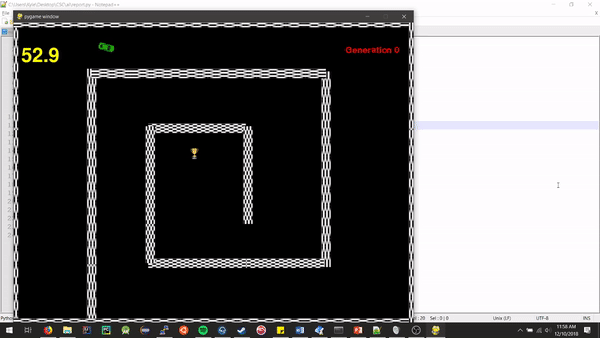

# CSC434AIFinalProject
The capstone project using Artificially Intelligent systems.

<h2>The Project</h2>

<p>Using a Genetic Algorithm and a Neural Network, create a system that can maneuver a track.
</p>



<h3>Dependencies</h3>
<i>requirements.txt also takes care of all required pip dependencies</i>
<i>The project was developed on a UNIX system running Ubuntu 18,04</i>
<table>
	<tr>
		<th>Application/Module</td>
		<th>Command</th>
	</tr>
	<tr>
		<td>Python 3</td><td>sudo apt install python3</td>
	</tr>
	<tr>
		<td>Pip (Module installations)</td><td>sudo apt install python3-pip</td>
	</tr>
	<tr>
		<td>Numpy</td><td>pip install numpy</td>
	</tr>
	<tr>
		<td>Pygame</td><td>pip install pygame</td>
	</tr>
</table>


<h3>Arguments & Features</h3>

<p>By incorporating several command line arguments to be passed into 
the program, several other features also exist outside the arguments<p>

<h5>Arguments</h5>
<ol>
	<li>-p, --pool		Overrides how many cars are spawned.</li>
	<li>-ne, --noevolve	Disables genetic evolution.</li>
	<li>-f, --file		File that contains any number of gene sets, must be in pre-existing list notation.</li>
</ol>

<b>Examples</b>

<i>Run program to evaluate success of a single participant</i> 
```
python Main_Menu.py -p 1 -ne --file trained_gene.txt
```

<p>
One of the great hidden features of this project is the acceptance of outside models.
The model must mimic the same number of inputs and outputs but all the rest is reconfigured within the
genetic.load() function within genetic.py.

By placing the models/ directory generated by Tensorflow, the program will
automatically load the newly created model into the program and create it's participants based on
the initial gene set found.
</p>

<h3>Closing Remarks</h3>
<p>The overall entirety of the project has placed a great deal of interest into investing more time into this project. 
By building a successful system, many of the internals are lacking a deal of structure as continuous hacking and rebuilding had to occur, all in the sake
of getting this working. For that, anyone wishing to develop the project further should first reconsider the code basis and possibly put forth effort into rebuilding the software
into a more legible and up to par for code standards.
</p>
